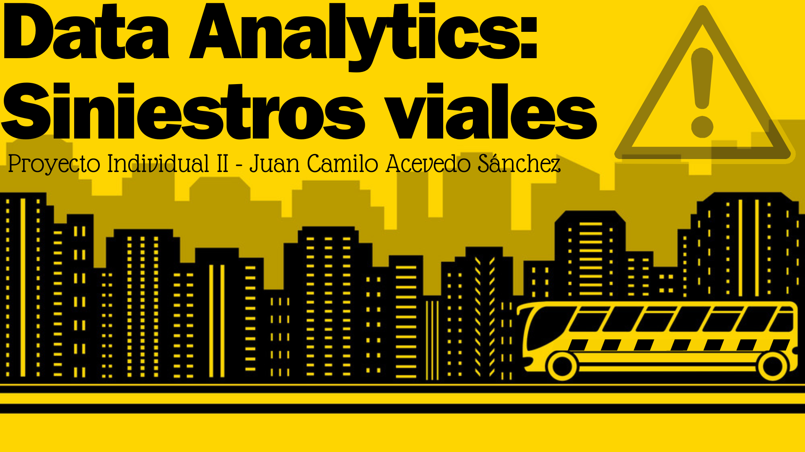

# Proyecto Data Analytics: Siniestros Viales Ciudad De Buenos Aires.
## Introducción
Bienvenidos a mi proyecto de Análisis de datos, en él entenderemos juntos el set de datos de siniestros viales de la Ciudad Autónoma de Buenos Aires, para así poder llegar a conclusiones y gráficos que nos muestren estadísticas muy interesantes, muchas gracias por tu interés y por tomarte tu tiempo explorándolo. Siéntete libre de preguntar cualquier duda que tengas sobre él.
## Indice
[Descripción](#descripción) - [Tareas desarrolladas](#tareas-desarrolladas) - [Estructura del proyecto](#estructura-del-proyecto) - [Instrucciones de instalación y uso](#instrucciones-de-instalación-y-uso) 
## Descripción
El proyecto presente es una parte de la etapa LABS del Bootcamp para Ciencia de Datos de SoyHenry, donde utilizo todos los conocimientos adquiridos a lo largo de todas las etapas del Bootcamp para llevar a cabo el rol de un Analista de Datos, abordando la limpieza de datos para su uso en el Análisis de Datos Exploratorio (EDA), la exportación de estos para la presentación de un [DashBoard](Dashboard/siniestros_viales.pbix), con visualizaciones interactivas tanto en distribuciones de los datos, relaciones, y verificación de cumplimiento de KPIs para los periodos establecidos.

## Tareas desarrolladas
1. **ETL:** *Obtuvimos* los datos de el [repositorio](https://github.com/soyHenry/PI_DA/tree/Full_Time?tab=readme-ov-file) que propuso el proyecto, para empezar realizando una *limpieza* de todos los datos con **pandas** en el [Notebook ETL](Notebooks/ETL.ipynb). Para por último *exportar* estos datos para su uso en el [Análisis de datos exploratorio](Notebooks/EDA.ipynb).

2. **EDA:** Los conjuntos de datos que limpiamos previamente fueron, el de información de las víctimas que sufrieron un siniestro, y del de la información sobre ese siniestro, en el [EDA](Notebooks/EDA.ipynb). los tratamos por separado y analizamos la relación de las variables junto a su distribución. A su vez logramos detectar **Outliers** por medio de la observación y gracias a el entendimiento del set de datos por realizar un **análisis** a cada observación que hacíamos, estábamos listos para realizar el [DashBoard](Dashboard/siniestros_viales.pbix) que presentaría lo más importante de dicho análisis.

3. **KPIs:** Para el proyecto se pidieron 3 **indicadores claves de rendimiento (KPI)**, este proceso se realizó en el [Notebook KPIs](Notebooks/KPIs.ipynb), el cual tiene las **consultas** necesarias para obtener los valores que consideré importantes para medir los siguientes indicadores:
    - **Reducción de tasa de homicidios en siniestros viales del 10% respecto al semestre anterior:** En este KPI, separé los datos en grupos de cada 6 meses, para así obtener luego la tasa de homicidios, la cual se obtuvo con la fórmula: $(HomicidiosEnSiniestrosViales / PoblaciónTotal) * 100,000$. Luego se calcularon los cambios en porcentaje, y el objetivo del mes, todo esto en base al mes anterior.
    - **Reducción de la cantidad de accidentes de motociclistas en un 7%, respecto al año anterior:** Este fue un poco más sencillo ya que solo hubo que agrupar por año, contando los registros, para así obtener las estadísticas de cambio porcentual, y objetivos, nuevamente en base al mes anterior.
    - **Reducción de la cantidad de accidentes de peatones en un 10%, respecto al año anterior:** Este KPI se calculo de la misma manera que el anterior, pero cambiando nuestros objetivos, en específico, el indice de reducción siendo 10% y la víctima siendo peatones.
4. **DashBoard:** El dashboard lo cree usando [PowerBI Desktop](https://powerbi.microsoft.com/es-es/desktop/), en él podemos encontrar distintas páginas, entre ellas:
    - la distribución o tendencia de las variables, en la cual podemos observar qué tantos accidentes hay en cada valor dentro de una categoría, por ejemplo, qué tantos accidentes hubo en la categoría 'Año', en cada uno de sus valores, junto con datos adicionales como el género de los accidentes, la edad promedio y los roles y tipos de carretera involucrados en estos.  
    - Las relaciones entre los **Acusados** y **Victimas** de los siniestros viales, esta exploración me pareció muy interesante mostrarla desde que la realicé en el EDA, en ella podemos ver la relación que hay entre dichas variables, por ejemplo, cuando un **vehículo** de carga es acusado de un accidente, normalmente la víctima es una **moto**, algo que sucede mucho más que cuando la victima es un **peatón**. Para todo esto se incluyeron filtros que enriquezcan la visualización personalizada de cada persona que quiera consultar datos más específicos.  
    - Por último realizamos la visualización de cada **KPI**, en este caso, usamos una gráfica con 2 líneas, una para el valor que estamos midiendo, y otra para el objetivo de ese valor, la idea es que el valor esté por debajo del objetivo, ya que la idea de los KPI en este caso es reducir los siniestros y homicidios, así mismo un indicador para ver si se logró el KPI en el año filtrado (Si no se filtra alguno se tomará el último año). Y por último un indicador que nos dice el porcentaje que disminuyó o aumentó la variable para la fecha, respecto a la fecha anterior, junto con una marca en el objetivo que se debía reducir, todo esto con colores interactivos que facilitan la identificación de que si se logró o no uno de ellos, y con filtros para cada fecha que se quiera conocer si se logró o qué tan cerca se estuvo de llegar.
    
## Estructura del proyecto  
**Directorios:**:<br><br>
    - [DashBoard](Dashboard/) - Contiene el [DashBoard](Dashboard/siniestros_viales.pbix) realizado para el proyecto, junto con los [datos](Dashboard/data.csv) finales utilizados en él.<br><br>
    - [Data](Data/) - Contiene el [set de datos crudo](Data/homicidios.xlsx) recibido, con el cual empezamos las limpiezas, contiene las carpetas [KPI](Data/KPIs) y [Processed](Data/Processed).  
    ------- [KPI](Data/KPIs) - Contiene los datos utilizados para evaluar los KPI, [Reducción 10% homicidios semestre](Data/KPIs/kpi_homicidios.csv), [Reducción 7% accidentes motos año](Data/KPIs/kpi_motos.csv) y [Reducción 10% accidentes peatones año.](Data/KPIs/kpi_peatones.csv).  
    ------- [Processed](Data/Processed) - Contiene los datos procesados en el [ETL](Notebooks/ETL.ipynb) y usados en el [EDA](Notebooks/EDA.ipynb).<br><br>
    - [assets](assets/) - Contiene imágenes usadas en el repositorio e información GEOJSON usada para crear un mapa en el EDA.<br><br>
    - [Notebooks](Notebooks/) - Contiene los notebooks de limpieza [ETL](Notebooks/ETL.ipynb), de Análisis [EDA](Notebooks/EDA.ipynb) y de KPIs [KPIs](Notebooks/KPIs.ipynb).<br><br>
    - **Otros/Raíz** - Contiene información para ejecutar el repositorio localmente, y archivos git para el correcto funcionamiento de github, entre otros.  

## Instrucciones de instalación y uso
### Uso del dashboard:
Para usar el DashBoard solo necesitaras descargarlo en [este enlace](https://github.com/Aeregon-Sharks/Data-Analytics-Accidentes/blob/main/Dashboard/siniestros_viales.pbix), en los 3 puntos de la esquina superior derecha ó presionando CTRL + SHIFT + S, luego ejecutarlo ya sea en la [web de power BI](https://app.powerbi.com), o en [PowerBI desktop](https://powerbi.microsoft.com/es-es/desktop/).  
Al abrir el dashboard, para interactuar con cada gráfico o filtro, solo debes hacer click en ellos, en el caso de los gráficos, cada uno como por ejemplo una barra de un gráfico de barras, puede filtrar la página.  
**Recuerda que No necesitas ejecutar todo el proyecto para usar el DashBoard, ya que él guarda sus propios datos.** En caso de que quieras hacerlo para explorar el funcionamiento en persona, abajo están las instrucciones, recuerda que siempre puedes preguntar si tienes alguna duda sobre su uso.
### Uso del proyecto de manera local:

1. **Clona el repositorio:** Utiliza el comando:
    ```
    git clone https://github.com/Aeregon-Sharks/Steam-ML-Ops.git
    ```  
2. **Descarga los requerimientos:** Ejecuta:
    ```
    pip install -r requirements.txt
    ``` 
3. **Ejecuta los notebooks:** Ejecuta y explora los notebooks en el orden [ETL](Notebooks/ETL.ipynb), [EDA](Notebooks/EDA.ipynb) y [KPIs](Notebooks/KPIs.ipynb), asegúrate de ejecutar todas las celdas de el anterior antes de ejecutar el siguiente.<br><br>
4. **Experimenta:** Usa los datos resultantes de todo a tu gusto, también puedes explorar el DashBoard con powerBI. No olvides consultar el [EDA](Notebooks/EDA.ipynb) para un mejor entendimiento de los datos.<br><br>

